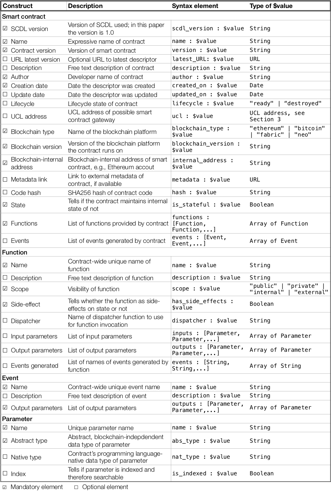

# Smart Contract Description Language (SCDL)

**Version**: 1.0.0

**Date**: July 31, 2019

**Authors**:  
  Andrea Lamparelli  
  Ghareeb Falazi  
  Uwe Breitenbücher  
  Florian Daniel  
  Frank Leymann

## Introduction
This document specifies the Smart Contract Description Language (SCDL) intended to provide an abstract description format for smart contracts that is independent of any specific blockchain technology.

## Language metamodel
The metamodel of SCDL is illustrated by the following figure, which introduces all the necessary concepts and relationships.


According to the metamodel, a smart contract can be seen as a blockchain- or web-accessible entity that is characterized by a set of descriptive metadata elements, a set of functions and a set of events.

Typical **metadata** are generic attributes like contract name, description, author and version, but also access-oriented attributes like the UCL address for external consumers and the blockchain type, version and internal address for internal consumers. Where available (e.g., for Ethereum smart contracts) publicly accessible metadata can be linked and a hash of the contract's code can be added to allow developers to check if a descriptor is up to date.

**Functions**, too, have a name and a description and are characterized by the set of input and return parameters they consume/produce; parameter lists are ordered (the order is needed for some platforms to be able to properly invoke functions). Functions may further produce events, e.g., for the implementation of asynchronous communication with consumers, have a scope (e.g., public vs. private), produce or not side-effects (change or not the state), and specify a dispatcher function for those platforms where functions are not invoked directly (e.g., Hyperledger Fabric).

**Events** have a name, a description and an ordered list of output parameters. **Parameters** have a name, an abstract data type (for external consumers), a native data type (for internal consumers) and may be indexed to enable consumers to query events on the blockchain.

The metamodel does not explicitly provide any **extensibility** points. If additional properties are needed, these can simply be added as properties to the composite objects of the language, i.e., smart contract, function, event, parameter. For instance, if a provider wants to explicitly mention the programming language of a given smart contract, this could be achieved by adding a language property to the smart contract object.

As for now, the specification assumes that there exists a suitable agreement between the provider and the consumer regarding the *costs* the provider may incur when executing smart contracts on behalf of the external consumer (internal consumers are charged directly by the blockchain platform).

## JSON binding
The current proposal is to equip the metamodel with a concrete syntax based on JSON, which is a format that is natively supported by multiple blockchain platforms and, hence, maintains consistency with existing conventions.

The translation from the metamodel to a concrete syntax follows few simple rules: *entities with associated properties* are represented as JSON objects with properties; *composition relationships* are translated into JSON arrays; the *order* of parameters of functions or events is expressed by the order of the parameters inside their respective arrays; *abstract data types* of parameters are expressed using [JSON Schema](https://json-schema.org).

The following table defines each individual language construct in detail and equips it with a respective domain of possible values.




The general **structure** of a SCDL descriptor is thus as follows:

```javascript
{ "scdl_version" : "1.0.0",       // generic smart contract properties
  "name" : "TokenConversion", ...    
  "functions" : [
    { "name" : "convert", ...                   // function properties
      "inputs" : [
        { "name"       : "amount",
          "abs_type"   : "number",
          "nat_type"   : "uint64",
        }, ...                                   // list of parameters
      ],
      "outputs" : [...],                         // list of parameters
      "events"  : [...]                          // list of parameters
    }, ...                                        // list of functions
  ],
  "events" : [
    { "name"    : "...", ...                       // event properties
      "outputs" : [...],                         // list of parameters
    }, ...                                           // list of events
  ]
}
```


## Example
tbd
