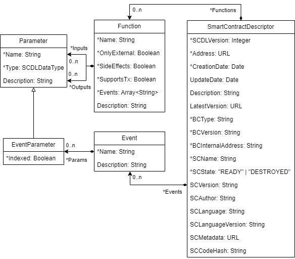
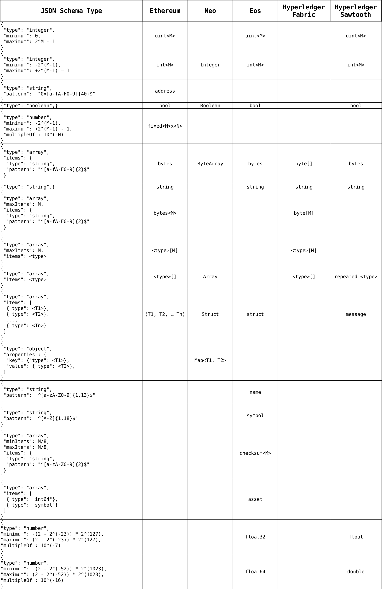

# Smart Contract Description Language (SCDL)

**Version**: 2.0.0

**Date**: July 31, 2024

**Authors**:  
  Andrea Lamparelli  
  Ghareeb Falazi  
  Uwe Breitenbücher  
  Florian Daniel  
  Frank Leymann

## Introduction
This document specifies the Smart Contract Description Language (SCDL) intended to provide an abstract description format for smart contracts that is independent of any specific blockchain technology.

## Language metamodel
The metamodel of SCDL is illustrated by the following figure, which introduces all the necessary concepts and relationships.
Attributes annotated with "*" are mandatory.



According to the metamodel, a smart contract can be seen as a blockchain- or web-accessible entity that is characterized by a set of descriptive metadata elements, a set of functions and a set of events.

Typical **metadata** are generic attributes like contract name, description, author and version, but also access-oriented attributes like the [SCL address](https://github.com/ghareeb-falazi/scl) for external consumers and the blockchain type, version and internal address for internal consumers. Where available (e.g., for Ethereum smart contracts) publicly accessible metadata can be linked and a hash of the contract's code can be added to allow developers to check if a descriptor is up to date.

**Functions**, too, have a name and a description and are characterized by the set of input and return parameters they consume/produce; parameter lists are ordered (the order is needed for some platforms to be able to properly invoke functions). Functions may further produce events, e.g., for the implementation of asynchronous communication with consumers, have a scope (e.g., public vs. private), produce or not side-effects (change or not the state), and specify a dispatcher function for those platforms where functions are not invoked directly (e.g., Hyperledger Fabric).

**Events** have a name, a description and an ordered list of output parameters. **Parameters** have a name, an abstract data type (for external consumers), a native data type (for internal consumers) and may be indexed to enable consumers to query events on the blockchain.

The metamodel does not explicitly provide any **extensibility** points. If additional properties are needed, these can simply be added as properties to the composite objects of the language, i.e., smart contract, function, event, and parameter. For instance, if a provider wants to explicitly mention the programming language of a given smart contract, this could be achieved by adding a language property to the smart contract object.

As for now, the specification assumes that there exists a suitable agreement between the provider and the consumer regarding the *costs* the provider may incur when executing smart contracts on behalf of the external consumer (internal consumers are charged directly by the blockchain platform).

The table below summarizes SCDL metadata attributes and their semantics:

| Attribute         | Type       | Description                                                                                                                                                                                                                              |
|-------------------|------------|------------------------------------------------------------------------------------------------------------------------------------------------------------------------------------------------------------------------------------------|
| SCDLVersion       | Integer    | the SCDL language version used. For compatibility with the current specification, this value must be "2.0.0".                                                                                                                            |
| Address           | URL        | the SCL address of the smart contract instance.                                                                                                                                                                                          |
| CreationDate      | Date       | the date in which the SCD was created.                                                                                                                                                                                                   |
| Description       | String     | human-readable description of the smart contract.                                                                                                                                                                                        |
| LatestVersion     | URL        | a URL to the latest SCD that describes this smart contract instance in case multiple SCDs exist for it.                                                                                                               |
| BCType            | String     | the hosting blockchain system type, e.g., "hyperledger-fabric".                                                                                                                                                                  |
| BCVersion         | String     | the specific protocol version of the blockchain system hosting the smart contract instance. The transaction processing guarantees and other characteristics of blockchain transactions might differ based on the specific blockchain protocol version. |
| BCInternalAddress | String     | the smart contract instance address within the hosting blockchain system. The format depends on BCType.                                                                                                                          |
| SCName            | String     | the name of the smart contract.                                                                                                                                                                                                          |
| SCState           | enum       | the state of the smart contract instance. Possible values are "READY" and "DESTROYED".                                                                                                                                                   |
| SCVersion         | String     | the version of the smart contract.                                                                                                                                                                                                       |
| SCAuthor          | String     | the name of the smart contract author.                                                                                                                                                                                                   |
| SCLanguage        | String     | the programming language used to implement the smart contract. For some platforms, the specific choice of programming language affects the supported features.                                                                           |
| SCLanguageVersion | String     | the language version used for programming the smart contract.                                                                                                                                                                            |
| SCMetadata        | URL        | a URL to the machine-readable metadata that is produced when the smart contract is compiled and packaged.                                                                                                                          |
| Functions         | Function[] | non-private smart contract functions.                                                                                                                                                                                                    |
| Event             | Event[]    | the events that might be emitted during function execution.                                                                                                                                                                              |
| SCCodeHash        | String     | the SHA256 hash of the smart contract code. This can be used to verify the integrity of a given source code file.        
| __Entity-Specific Attributes__ |||
| Function.OnlyExternal  | Boolean          | a Boolean that takes the value _true_ iff the function is only accessible via external consumers.                                                                              |
| Function.SideEffects      | Boolean          | a Boolean that takes the value _true_ iff executing the function might result in altering the smart contract instance state.                                                   |
| Function.SupportsTx       | Boolean          | a Boolean that takes the value _true_ iff the function can be invoked as part of an atomic distributed transaction.                                                            |
| Function.Inputs           | Parameter[]      | an ordered array of input parameters for the function.                                                                                                                               |
| Function.Outputs          | Parameter[]      | an ordered array of output parameters for the function.                                                                                                                              |
| Function.Events           | Event[]          | a set of events that might be emitted during function execution.                                                                                                                     |
| Function.Description      | String           | a human-readable description of the function.                                                                                                                                        |
| Event.Name             | String           | the name of the smart contract event.                                                                                                                                                |
| Event.Params           | EventParameter[] | the parameters that accompany the occurrences of the event.                                                                                                                          |
| Event.Description      | String           | a human-readable description of the event.                                                                                                                                           |
| Parameter.Name         | String           | the name of the parameter.                                                                                                                                                           |
| Parameter.Type             | SCDLDataType     | the type of the parameter (see \cref{ch3-sec:handling-data-types-in-scdl} for more details).                                                                                         |
| Parameter.Description      | String           | a human-readable description of the parameter.                                                                                                                                       |
| EventParameter.Indexed | Boolean          | a Boolean that takes the value _true_ iff the event parameter is indexed, i.e., the blockchain system allows searching for event occurrences using this parameter as a filter. |                                                                                                                |

## JSON binding
The default syntax for the documents that follow the SCDL metamodel, i.e., Smart Contract Descriptors (SCDs), uses JSON.
The reason behind this choice is that clients of all analyzed smart contract platforms are required to communicate with the blockchain nodes using JSON payloads in order to interact with the hosted smart contracts.
Hence, this choice maintains consistency with existing conventions and eases adoption for client applications.
Nonetheless, the metamodel is compatible with other formats, e.g., XML, which can be used if needed.

In order to transform an SCD into a JSON object literal, the following rules are followed:

- The _SmartContractDescriptor_ entity represents the root object literal.
- An attribute in the metamodel is transformed into a JSON property.
The key of this property is derived from the name of the metamodel attribute by using small letters and underscores "_" between words.
For example, _SCLLanguageVersion_ is transformed into `scl_language_version`.
Depending on the type of the attribute, the value of the attribute is transformed into a string literal, a number literal, a Boolean literal, or an array of literals.
Empty optional attributes are omitted from the resulting JSON.
- A composition relationship between two entities in the metamodel is turned into a JSON property within the parent entity.
If the child entity occurs only once in the parent entity, e.g., _ParameterType_ in _Parameter_, then the value of the corresponding JSON property is a JSON object literal that represents the child entity.
However, if the child entity may occur multiple times in the parent entity, e.g., _Function_ in _SmartContractDescriptor_, then the value of the corresponding JSON property is an array of JSON object literals that represent the child entity occurrences.


The general **structure** of an SCDL descriptor is thus as follows:

```[json]
{	
  "scdl_version" : "1.0.0",		
	"name": "RoomManager", ...                                   // metadata attributes
	"functions": [{	
			"name": "book", ...                                  // function attributes
			"inputs": [{"name": "amnt","type": "number"},...],   // input params	
			"outputs": [...],                                    // output params
			"events": [...]                                      // event names
	}, ...],
	"events" : [{ 
			"name": "Booked", ...                                // event attributes
			"params": [...],                                     // event params
	}, ...]
}
```

## Data encoding

To enable external consumers to understand parameter data types without having blockchain-specific knowledge, [JSON Schema](https://json-schema.org/) is used as a basis for a technology-agnostic type system capable of representing any native data type of the supported smart contract platforms.
The table below shows such mappings for commonly used native data types of three smart contract platforms.
Note that some SCDL Data Types do not necessarily have corresponding datatypes in all supported blockchain system types.
For example, the SCDL Data Type that represents a Boolean value does not have a corresponding datatype in Hyperledger Fabric.
This does not constitute a problem, since any given SCD is specific to a particular smart contract instance hosted on a fixed blockchain system, which means it will only contain SCDL Data Types that do have mappings to this system.

These mappings are used when generating an SCD based on the code of a given smart contract and also when a software component needs to communicate with a smart contract instance with the help of a given SCD.

Using JSON Schema as a basis for SCDL Data Types enables client applications to use existing JSON Schema validation libraries to validate user-provided data before trying to communicate with actual smart contract instances using [SCIP](https://github.com/lampajr/scip).
Of course, client applications must have access to the SCDs that describe the target smart contract instances in order to extract the SCDL Data Types from them.
Client applications can obtain such descriptors using an SCDL repository, for example.

Here we show how blockchain native types of the analyzed blockchain system types can be mapped to JSON Schema.



## Examples

### ZilliqaToken Ethereum Contract

* [SCDL](zilliqa.json)

### Digest Ethereum Contract

* [Contract](https://github.com/ghareeb-falazi/SCIP-CaseStudy/blob/master/SmartContracts/Ethereum/Digest/contracts/Digest.sol)
* [SCDL](digest.json)

### Seafood Ethereum Contract

* [Contract](https://github.com/ghareeb-falazi/SCIP-CaseStudy-2/blob/master/SmartContracts/Ethereum/Seafood/contracts/Seafood.sol)
* [SCDL](seafood.json)

### Dairy Hyperledger Fabric Contract

* [Contract](https://github.com/ghareeb-falazi/SCIP-CaseStudy-2/blob/master/SmartContracts/Fabric/dairy/javascript/lib/dairy.js)
* [SCDL](dairy.json)